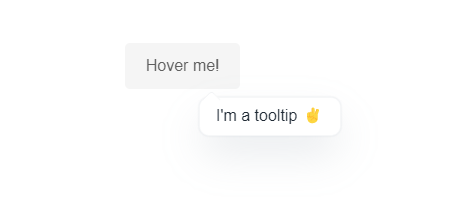

# Tiny JS Tooltips
#### A very simple and lightweight tooltips system created with vanilla JavaScript.



### Features
* Created with Vanilla JS 🌈
* ⚡ Lightweight
* Live movement, follow the cursor! ✨
* One line of code 😎
___

#### Usage
```html
<link rel="stylesheet" href="src/Tiny-JS-Tooltips.min.css">
<!-- </head> -->
...
<script src="src/Tiny-JS-Tooltips.min.js"></script>
<!-- </body> -->
```

Now add the `data-tooltip` attribute to any html element.
```html
<span data-tooltip="Your tooltip text goes here!">Hi, hover me!</span>
```
